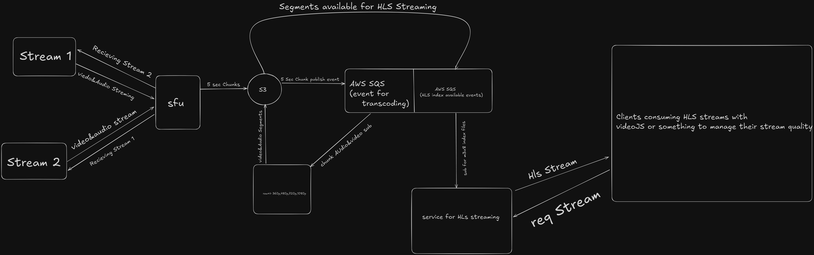

Here’s a `README.md` for your SFU (Selective Forwarding Unit) project. It includes:

* Setup instructions
* FFmpeg installation
* Development run steps
* An architectural diagram with explanation of how it would scale in the cloud

---

````markdown
# SFU Streaming System

This project sets up a Selective Forwarding Unit (SFU) for real-time audio/video communication and HLS streaming via AWS. It supports multi-user video conferencing with HLS broadcasting, chunk-based S3 uploads, and adaptive playback.

## 🛠️ Local Development Setup

### 1. Clone the Repository
```bash
git clone https://github.com/your-username/your-sfu-project.git
cd your-sfu-project
````

### 2. Install FFmpeg (Required for Media Processing)

#### macOS (via Homebrew)

```bash
brew install ffmpeg
```

#### Ubuntu/Debian

```bash
sudo apt update
sudo apt install ffmpeg
```

#### Windows (via Chocolatey)

```bash
choco install ffmpeg
```

> Ensure `ffmpeg` is globally accessible from the terminal: `ffmpeg -version`

### 3. Install Dependencies

```bash
yarn install
```

### 4. Start Development Server

```bash
yarn run dev
```

---

## 📊 System Architecture



### 📌 How It Works

* **Stream 1 & Stream 2**: Peer clients send and receive WebRTC streams through the SFU.
* **SFU (Selective Forwarding Unit)**: Handles media routing between multiple peers. It also sends media streams to be chunked and pushed to S3 for HLS.
* **S3**: Stores 5-second HLS chunks (`.ts`) and playlist files (`.m3u8`).
* **AWS SQS**:

  * One queue publishes events when new chunks are uploaded to S3.
  * Another queue informs downstream services about available HLS playlists.
* **Transcoding Service**: Listens to chunk events and transcodes streams into multiple quality variants (e.g., 360p, 480p, 720p, 1080p).
* **HLS Service**: Serves `.m3u8` and `.ts` files on request. Responds to clients requesting adaptive stream URLs.
* **Client Player**: Consumes HLS via Video.js or any other HLS-compatible player, managing quality switches based on network conditions.

---

## ☁️ Cloud Deployment Overview

In the cloud, this architecture would be deployed as follows:

* **SFU Node**: Runs on an EC2/GKE/ECS instance, exposed via a secure WebRTC signaling server (WebSocket-based).
* **HLS Chunking**: FFmpeg or GStreamer runs within containers that segment streams and push to S3.
* **S3**: Stores all media assets with lifecycle policies to optimize cost.
* **SQS**: Used to decouple events from transcoding and serving systems.
* **Transcoding**: Auto-scaled service (Lambda, ECS Fargate, or K8s Job) that produces resolution variants.
* **HLS Service**: CDN-enabled access (e.g., via CloudFront) to serve clients with low latency.
* **Client**: Connects to SFU for real-time calls or fetches `.m3u8` from your public endpoint for playback.

---

## 🚀 Future Enhancements

* Support simulcast from browser to SFU.
* Implement TURN/STUN failover logic.
* Analytics for chunk delivery and stream health.
* DRM or token-based secure access to HLS URLs.

---
